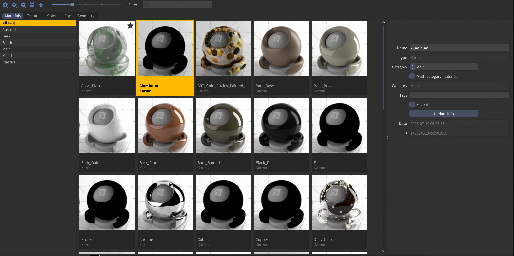

# Amaze

### Browse it, save it, drag it.

> **⚠️ Work in progress.** Amaze is under active, rapid development — `main` is a moving target and there is no versioning: **the latest commit is the version.** It runs in daily production use by its author, but if you found this repo in the wild, expect rough edges.

Materials, textures, colour palettes, Copernicus networks, geometry, code — the things you dig through folders and old scenes to find, gathered into one place and always a click away. Browse it, save to it, drag it straight into your scene.

Save a material and get a real rendered thumbnail back. Drop a texture onto a parameter like it came from Finder. Pull a free material from PolyHaven without ever leaving Houdini. Lift a colour straight out of a Josef Albers study or a Sanzo Wada plate. Keep the wrangle you keep rewriting. Assign a shader by dragging it onto the object in your viewport — done.

It began as [egMatLib](https://github.com/eglaubauf/egMatLib), Elmar Glaubauf's material library, and grew — one section at a time — into what you see here.

[](scripts/python/matlib/res/img/assetlib_ui.png)

**→ [Read the manual](MANUAL.md)** — a walkthrough of every function.

## Sections

- **Materials** — a curated library of Houdini-native material networks with rendered shaderball thumbnails. Redshift (classic + USD builders), Karma/MaterialX, Octane (classic + Solaris builders), Mantra. Categories, tags, favorites, renderer filter, search.
- **Textures** — register any folders on disk and browse their images (PNG/JPG/EXR/HDR/TGA/...) with cached thumbnails. Double-click or drag to load a texture onto any node's file parameter.
- **Colors** — curated color-theory palettes (Sanzo Wada's *A Dictionary of Color Combinations*, Paul Klee, Josef Albers, Johannes Itten) plus your own saved gradients. Apply as stepped or linear ramps, or pick single swatches for color parameters.
- **Cop** — save Copernicus networks (whole networks or node selections) with the network's own output image as the thumbnail, and load them back into any COP context.
- **Geometry** — register model folders (`.bgeo`, `.obj`, `.fbx`, `.abc`, `.usd`, ...) with viewport-rendered thumbnails. Double-click to import, drag onto file parameters.
- **Code** — a reusable snippet library for VEX / OpenCL / Python, with a syntax-highlighted preview on each tile and a curated "Starter Toolbox" to get going. Double-click or drag onto a node to apply.

## Highlights

- **Online material libraries, built in** — browse thousands of free CC0/MIT materials from **PolyHaven**, **AMD GPUOpen** and **PhysicallyBased** right in the panel (View ▸ Online Materials) and import them into your own library with one double-click. Imported materials keep a credit + license note for the creators.
- **Drag and drop everywhere** — drag a material onto an object in the OBJ viewport to assign it, onto a Solaris viewport object to trigger Houdini's native material assigner, onto a `materiallibrary` LOP to import into it. Drag any asset onto a sidebar **category** to file it there (the category glows as you hover). Drag textures/geometry onto parameter fields like files from Finder.
- **Standard file-save semantics** — re-saving a node that matches an existing library entry offers Overwrite / Save as New.
- **Redshift → Karma converter (test)** — best-effort translation of Redshift materials into proper Karma Material Builders, with an honest report of everything it couldn't translate.
- **Houdini 22 theme aware** — the panel derives its palette from your Houdini theme (base/accent/highlight) automatically.
- **Fast** — background thumbnail loading, disk caches for texture/geometry thumbnails, tuned to stay light with 500+ asset libraries.
- **Recoverable storage** — assets are Houdini-native node archives (`.mat` + `.interface` + JSON index). If the plugin dies, your assets are still loadable with vanilla Houdini.

## Requirements

- Houdini **21.0+** (developed and tested on 21.0 and 22.0, macOS/Apple Silicon; theme-following requires 22)
- Renderers: **Redshift** and **Karma/MaterialX** are the primary targets; **Octane** supported; Mantra works but sees less testing
- `$OCIO` must be set for material saves (thumbnail rendering)
- Python 3, unrestricted Houdini licensing (Commercial/Indie)
- Linux/Windows: nothing intentionally platform-specific beyond the texture-thumbnail fast path (which falls back automatically), but untested

## Installation

1. Copy (or clone) this repo to a folder of your choice, e.g. `/path/to/Amaze`.
2. Create a package file in a folder Houdini scans (e.g. `$HOUDINI_USER_PREF_DIR/packages/Amaze.json`) — a template ships at the repo root (`Amaze.json`); point `ASSETLIB` at the folder from step 1:

```json
{
    "env": [
        { "ASSETLIB": "/path/to/Amaze" }
    ],
    "path": [ "$ASSETLIB" ]
}
```

3. Launch Houdini and add an **Amaze** pane tab (New Pane Tab Type → Misc → Amaze).
4. First launch asks you to pick a library folder — that's where your saved assets live (keep it outside the plugin folder; changeable later in Preferences).

## Status

Actively developed (AI-assisted). Found a bug? Open an issue — but check the WIP banner above first: `main` moves fast.

## Acknowledgements

- **[Elmar Glaubauf](https://github.com/eglaubauf)** — Amaze began as his egMatLib. Thank you for the foundation to build on.
- **Rich Nosworthy** — the complex shaderball: https://www.richnosworthy.tv
- Color palette sources: Sanzo Wada (public domain, via [dblodorn/sanzo-wada](https://github.com/dblodorn/sanzo-wada)), Paul Klee, Josef Albers, Johannes Itten (interpretive palettes from public-domain works).

## License

**GPLv3**, same as upstream — see [LICENSE](LICENSE). Free to use, modify and embed as stated in the license; selling or reselling of the code is not permitted.
